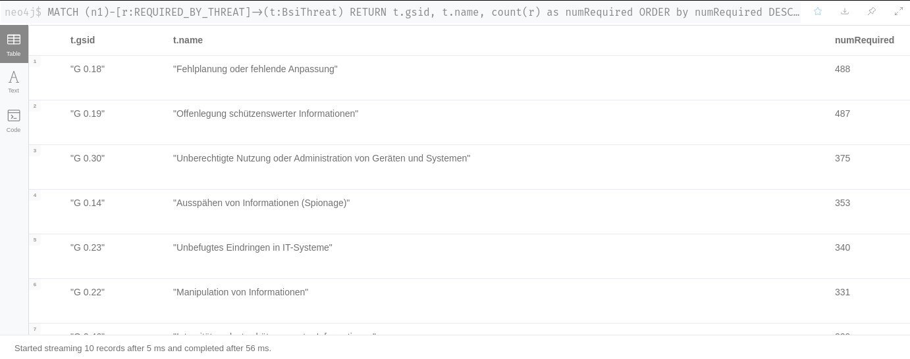

# BSI IT-Grundschutz Import for Neo4J

This repository contains scripts to convert the German BSI IT-Grundschutz standard into a Neo4J database. Due to copyright reasons the repository does **not** contain any actual content published by the BSI. Please see the notes below on instructions where to retreive the required content.

You will need the APOC library to import the content into the database.

## German BSI Grundschutz (IT-Baseline) Catalog

These scripts import a JSON representation of the German [IT-Baseline catalog](https://www.bsi.bund.de/EN/Topics/ITGrundschutz/itgrundschutz_node.html) ("IT-Grundschutz-Kompendium") into Neo4J. A script is provided to
convert an XML version of the catalog into a JSON format suitable for importing with APOC.

The source XML file that was used can be found as part of the [verinice](https://github.com/SerNet/verinice) project. Simply download the latest version of the catalog from the [content repository](https://update.verinice.org/pub/verinice/content_for_verinice/compendium/) and extract the content XML from the archive. Then import them using the scripts provided here. 

Then you may run queries against the data in Neo4J:

### *Example: Connections from modules ("Bausteine") to Safeguards ("Umsetzungshinweise")':*

### *Example: Which threats are referenced by the most safeguards:*

## Schema Visualization

The complete database schema currently looks as follows (this includes nodes from [SCKG](https://gitlab.com/redteam-project/sckg)):

